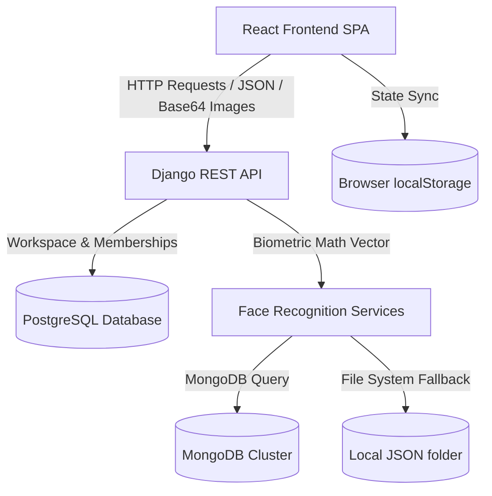

# Surge Suite

Surge Suite is a biometric face-recognition-powered productivity platform that enables secure, passwordless authentication through facial biometrics. The application identifies registered users in real time and grants access to their personalized workspace without relying on conventional password credentials.

Built for both personal and shared environments, Surge Suite supports multiple registered users on a single device while ensuring complete separation of user data. When an unrecognized face is detected, the application initiates a registration process to create a new user profile and securely associate facial embeddings with that account.

---

## Features

- **Biometric Registration & Authentication**: Face-based user registration and real-time passwordless login.
- **Relational Workspace Management**: Auto-provisioned isolated personal workspace on registration, with support for creating up to 5 owned workspaces (including archived ones) and joining unlimited team workspaces.
- **Collaborative Memberships**: Add and manage members within owned workspaces.
- **Archive & Recovery Lifecycles**: Move workspaces to an archived state with a 30-day recovery window before permanent deletion.
- **Polished Notes Library**: Features a premium monochromatic notes workspace with tags, VIBGYOR coloring, trash bin, shortcuts, and custom text formatting.
- **JSON Persistence Fallback**: Development-only fallback if MongoDB connectivity is lost.

---

## Technology Stack

### Frontend
- **Framework**: React 18.3.1 (Vite-powered SPA)
- **Styling**: Vanilla CSS with modern dark/light mode configurations.
- **Icons**: Lucide React

### Backend
- **Framework**: Django 6.0.7 & Django REST Framework (DRF)
- **Biometrics Stack**: ArcFace model, OpenCV, MTCNN, SSD-based detectors
- **Relational DB**: PostgreSQL
- **Biometric DB**: MongoDB (with local JSON filesystem fallback)

---

## System Architecture & Database Topology

Surge Suite maintains a clear separation between its persistence boundaries:



### 1. PostgreSQL (Relational Database)
PostgreSQL is the authoritative store for all core relational application data.
- **User Models**: Stores standard Django User records (`username` is set to the biometric `user_id` UUID string, and display names are saved in `first_name`).
- **Workspaces & Memberships**: Stores workspaces, owners, and membership tables (`Workspace` and `WorkspaceMembership` models).
- **Session State**: Session cookies and CSRF tokens are verified on the server side against this relational boundary.

### 2. MongoDB / Biometric Storage
MongoDB is the primary database for storing facial biometric data.
- **Collections**: Stores ArcFace 512-dimension floating-point face embeddings, names, timestamps, and registration device metadata in the `registered_faces` collection.
- **JSON Fallback**: If the MongoDB server is unreachable (e.g., due to local network or TLS handshake issues), database operations automatically fall back to writing/reading local JSON files under the `backend/authentication/services/registered_faces/` directory.

---

## Installation & Setup

Follow these steps to set up a local development environment.

### 1. Clone the Repository
```bash
git clone https://github.com/abhinavAryan47/surge-suite.git
cd surge-suite
```

### 2. Database Prerequisites
Ensure you have the following database engines running locally:
- **PostgreSQL**: Running on port `5432` with a database named `surge_suite` created.
- **MongoDB**: Running on port `27017` (or configured via connection string).

---

### 3. Backend Setup

1. **Navigate and create virtual environment**:
   ```bash
   cd backend
   python -m venv .venv
   source .venv/bin/activate
   # Windows: .venv\Scripts\activate
   ```

2. **Install requirements**:
   ```bash
   pip install -r requirements.txt
   ```

3. **Configure Environment Variables**:
   Copy `.env.example` to `.env` and configure your local settings:
   ```bash
   cp .env.example .env
   ```
   Edit `.env` to supply a secure `SECRET_KEY`, set `DEBUG=True`, and provide the correct credentials for `DATABASE_URL` (PostgreSQL) and `MONGO_URI` (MongoDB).

4. **Run Database Migrations**:
   ```bash
   python manage.py migrate
   ```

5. **Start the Django Development Server**:
   ```bash
   python manage.py runserver
   ```
   The backend will start running at `http://127.0.0.1:8000/`.

---

### 4. Frontend Setup

1. **Navigate to the frontend folder**:
   ```bash
   cd ../frontend
   ```

2. **Configure Environment Variables**:
   Copy `.env.example` to `.env` (it defines `VITE_API_URL` pointing to the backend API):
   ```bash
   cp .env.example .env
   ```

3. **Install npm dependencies**:
   ```bash
   npm install
   ```

4. **Start the Frontend Development Server**:
   ```bash
   npm run dev
   ```
   The frontend will start running at `http://localhost:5173/`. Open this URL in a modern web browser.

---

## Workspace Features & Lifecycles

Surge Suite workspace routing enforces strong ownership and scoping guidelines:
- **Default Scopes**: Every newly registered user gets a default `"Personal Workspace"` automatically created in the database.
- **Ownership Caps**: Each user is capped at owning a maximum of **5 workspaces** (including archived workspaces). This limit is enforced transactionally using PostgreSQL row-level locks on the user record during workspace creation.
- **Memberships**: Users can join an unlimited number of workspaces as a `MEMBER`.
- **Archival & Recovery**: Users can archive an owned workspace. Archived workspaces:
  - Are immediately hidden from normal access.
  - Remain stored in the database for a **30-day recovery window** (during which they can be restored by the owner).
  - Continue to count toward the owner's 5-workspace cap until purged.
- **Permanent Purges**: After the 30-day recovery window expires, workspaces and their memberships are permanently deleted. This is done by executing the backend purge task.

---

## Development & Testing Commands

### Backend Tests
Ensure the virtual environment is active in the `backend/` directory, then run:
```bash
python manage.py test authentication workspace
```

### Validate System Health
```bash
python manage.py check
```

### Run Workspace Purging Task
To permanently delete archived workspaces whose 30-day recovery window has passed:
```bash
python manage.py purge_archived_workspaces
```

### Frontend Build Compilation
```bash
npm run build
```

---

## Security & Privacy Notice
- **Facial Embeddings**: 512-dimension face vectors are currently stored in plaintext. Hardening vector encryption at rest represents documented security debt to be resolved in a later phase.
- **Session Authentication**: Authentic session credentials are derived exclusively on the backend from cookies. Browser `localStorage` is used solely to store non-sensitive display cues.
