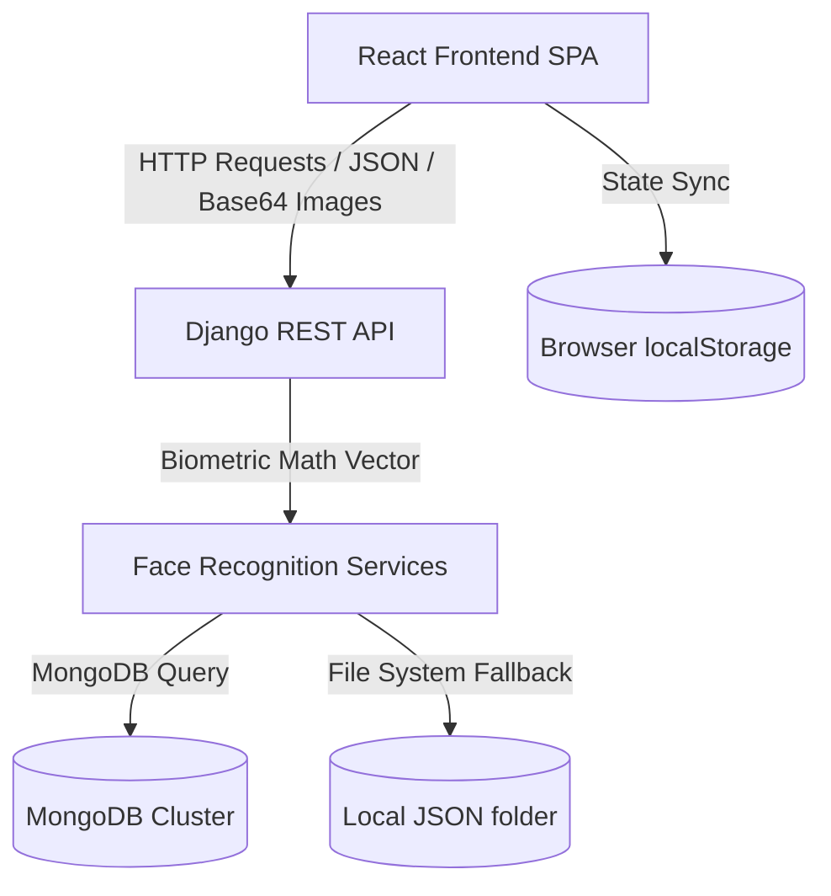

# Architecture Documentation

This document describes the current architecture of the **Surge Suite** application, verified as of Phase 0 stabilization.

---

## System Overview

Surge Suite is structured as a decoupled two-tier application:
1. **Frontend**: A single-page application (SPA) built using React and Vite, delivering a monochrome productivity dashboard.
2. **Backend**: A web API framework built using Django and Django REST Framework (DRF), primarily orchestrating biometric identification and authentication.

---

## Component Details

### 1. Frontend Architecture

The frontend is a single-page application built on Vite and React (18.3.1).
- **Styling**: Utilizes standard CSS files (`index.css`, `Notes.css`, `FaceAuthentication.css`) defining variables for custom themes (light and dark mode) and transitions.
- **Routing**: Handled by `react-router-dom` (`App.jsx`). Supported routes are:
  - `/` (Landing page)
  - `/login` (Biometric capture login page)
  - `/register` (User registration page)
  - `/dashboard` (Main workspace panel, protected by `ProtectedRoute`)
  - `*` (NotFound fallback)
- **State Management**:
  - Auth context (`AuthContext.jsx`) stores current user details and handles login/logout flow.
  - Theme context (`ThemeContext.jsx`) maintains the current light/dark preference.
  - Notes and workspace items are managed locally in `Dashboard.jsx` React state.
- **Persistence**: Notes and deleted notes are saved directly to the browser's `localStorage` (keys: `surge_notes` and `surge_notes_bin`).
- **Communication**: Frontend calls backend APIs using Axios. It has interceptors ready for attaching authorization tokens, though tokens are currently mocked (`getAuthToken()` returns `null`).

### 2. Backend Architecture

The backend is built with Django 5.1.6 (packaged dependencies specify Django 6.0.7) and Django REST Framework.
- **Core App (`core`)**: Provides a basic online status verification endpoint (`/api/v1/status/`).
- **Authentication App (`authentication`)**: Houses facial recognition endpoints:
  - `POST /api/v1/auth/register/`: Registers a user's name and face embedding from a base64 encoded image.
  - `POST /api/v1/auth/verify/`: Computes matching confidence for a base64 photo against database profiles.
  - `GET /api/v1/auth/status/`: Returns online status and total registered profiles.
- **Other Apps**: `users`, `workspace`, `notes`, `todo`, and `rag` are currently registered under Django's `INSTALLED_APPS` but contain empty configurations, empty models, and no routes.

### 3. Computer Vision & Face Authentication Pipeline

The computer vision logic resides in `backend/authentication/services/` and runs over standard machine learning libraries:
- **Face Detection (`detector.py`)**: Uses a prioritizing stack to find faces in a frame. Backends tried sequentially: `mtcnn`, `ssd`, `opencv`, `retinaface`.
- **Embedding Generation (`embedding.py`)**: Uses the **ArcFace** model (via TensorFlow/DeepFace) to generate 512-dimensional floating-point vectors from face crops.
- **Verification (`verifier.py`)**: Computes **cosine distance** between embeddings. If the distance is below a threshold (default `0.68`), it verifies the match.
- **Camera Stream (`camera.py`)**: Optional script for capturing local webcam frames using OpenCV.

---

## Current Persistence Mechanisms

1. **Relational Database**: Django specifies PostgreSQL as the relational database engine in `settings.py`. Currently, it only stores standard Django migration schemas and has no application tables.
2. **Document Database**: Face profiles (containing user metadata and embeddings) are saved to MongoDB. The MongoClient instance (`backend/database/connection.py`) reads connection strings from the environment.
3. **Local JSON Fallback**: If the MongoDB connection fails, the application falls back to storing face profiles inside the `backend/authentication/services/registered_faces/` subdirectory, with one JSON file per registered user.

---

## Future Target Architecture (Phase 1+)

- **Unified Persistence**: Move all notes, workspaces, and user metadata to a central PostgreSQL database.
- **Model Migration**: Transition frontend `localStorage` note states to proper Django ORM models stored in the relational database.
- **Secure Token Auth**: Harden the session validation layer with secure JWT/session token management.
- **Biometric Security**: Move face embeddings out of plaintext files/databases into encrypted structures or vector columns.
- **RAG & Agents**: Build a real retrieval pipeline for note indexing and enable secure agent triggers.
