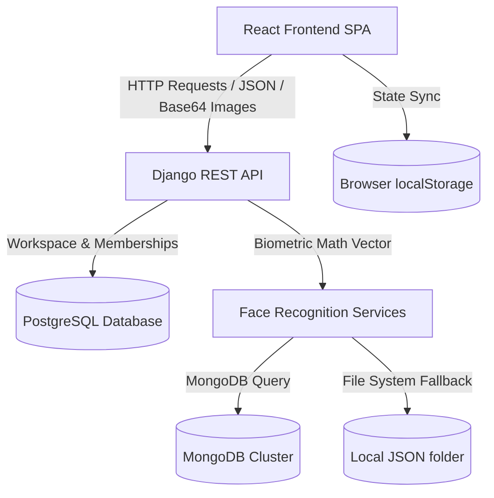

# Architecture Documentation

This document describes the current architecture of the **Surge Suite** application, verified as of Phase 3 workspace stabilization.

---

## System Overview

Surge Suite is structured as a decoupled two-tier application:
1. **Frontend**: A single-page application (SPA) built using React and Vite, delivering a monochrome productivity dashboard.
2. **Backend**: A web API framework built using Django and Django REST Framework (DRF), orchestrating biometric identification, authentication, and team workspaces.

---

## Component Details

### 1. Frontend Architecture

The frontend is a single-page application built on Vite and React (18.3.1).
- **Styling**: Utilizes standard CSS files (`index.css`, `Notes.css`, `FaceAuthentication.css`) defining variables for custom themes (light and dark mode) and transitions.
- **Routing**: Handled by `react-router-dom` (`App.jsx`). Supported routes are:
  - `/` (Landing page)
  - `/login` (Biometric capture login page)
  - `/register` (User registration page)
  - `/dashboard` (Main workspace panel, protected by `ProtectedRoute`)
  - `*` (NotFound fallback)
- **State Management**:
  - Auth context (`AuthContext.jsx`) stores current user details and handles login/logout flow.
  - Theme context (`ThemeContext.jsx`) maintains the current light/dark preference.
  - Workspaces selection and management states are loaded dynamically from backend APIs in `Dashboard.jsx`.
  - Notes and deleted notes are saved directly to the browser's `localStorage` (keys: `surge_notes` and `surge_notes_bin`).
- **Communication & Services**:
  - Frontend calls backend APIs using Axios.
  - `workspaceServices.js` provides client wrappers for all Workspace REST API operations: listing, creating, renaming, archiving, restoring workspaces, and managing membership lists.

### 2. Backend Architecture

The backend is built with Django 5.1.6 (packaged dependencies specify Django 6.0.7) and Django REST Framework.
- **Core App (`core`)**: Provides a basic online status verification endpoint (`/api/v1/status/`).
- **Authentication App (`authentication`)**: Houses facial recognition and session endpoints:
  - `POST /api/v1/auth/register/`: Registers a user's name and face embedding, creating a canonical Django `User` and a biometric face profile in a single atomic transaction. Automatically provisions a default personal workspace for the new user.
  - `POST /api/v1/auth/verify/`: Verifies a base64 image, resolves it to a Django `User` (stable UUID as username), and logs them in server-side. Automatically heals legacy users by provisioning a default workspace if one does not exist.
  - `GET /api/v1/auth/status/`: Returns online status, registered face count, and sets the Django CSRF cookie.
  - `POST /api/v1/auth/logout/`: Invalidate the Django session.
  - `GET /api/v1/auth/me/`: Retrieve current authenticated user details from the session.
- **Workspace App (`workspace`)**: Houses relational tables and APIs for workspace containment:
  - Models: `Workspace` (UUID identifier, owner reference, name, archived flags) and `WorkspaceMembership` (workspace, user, role).
  - Enforces workspace ownership limits (max 5 owned workspaces per user) using row-level locking on the `User` table to prevent concurrent creation bypasses.
  - Exposes endpoints under `/api/v1/workspaces/` for listing, retrieval, updates, archival/restoration, and membership operations.
- **Other Apps**: `users`, `notes`, `todo`, and `rag` are currently registered under Django's `INSTALLED_APPS` but contain empty configurations, empty models, and no routes.

### 3. Computer Vision & Face Authentication Pipeline

The computer vision logic resides in `backend/authentication/services/` and runs over standard machine learning libraries:
- **Face Detection (`detector.py`)**: Uses a prioritizing stack to find faces in a frame. Backends tried sequentially: `mtcnn`, `ssd`, `opencv`, `retinaface`.
- **Embedding Generation (`embedding.py`)**: Uses the **ArcFace** model (via TensorFlow/DeepFace) to generate 512-dimensional floating-point vectors from face crops.
- **Verification (`verifier.py`)**: Computes **cosine distance** between embeddings. If the distance is below a threshold (default `0.68`), it verifies the match.

---

## Relational Workspace Lifecycle & Retention

1. **Workspace Archival**: Archiving a workspace sets the `is_archived` flag to `true`, saves the `archived_at` timestamp, and sets `scheduled_deletion_at` to exactly 30 days from the current date/time. Retrieve and update operations on this workspace are immediately blocked.
2. **Workspace Restoration**: Before the 30-day deletion deadline passes, the workspace owner can restore the workspace. This clears the archive flag and removes scheduled deletion boundaries, enabling normal access again.
3. **Workspace Purging**: A background task or management command `purge_archived_workspaces` is executed to permanently delete workspaces and memberships whose `scheduled_deletion_at` date is in the past.
