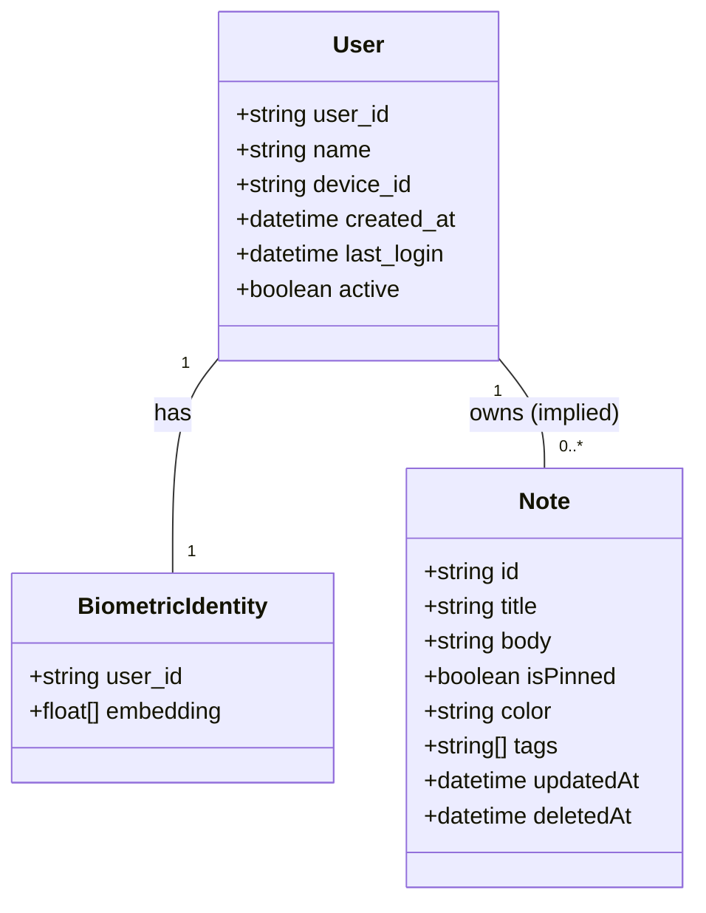

# Domain Model Documentation

This document describes the domain entities that currently exist or are clearly represented in the **Surge Suite** codebase.

---

## Entity Relationship Overview

The relationships between verified entities are mapped below:

---

## Entity Details

### 1. User
- **Purpose**: Represents an authorized individual with access to workspaces and documents.
- **Ownership & Control**: Associated with a specific hardware device and a biometric identity profile.
- **Attributes**:
  - `user_id` (string): Unique identifier.
  - `name` (string): User display name.
  - `created_at` (string/ISO timestamp): Profile registration timestamp.
  - `last_login` (string/ISO timestamp): Last successful verification timestamp.
  - `device_id` (string): Hardware device tag.
  - `active` (boolean): Active state flag.
- **Current Implementation**:
  - Defined in `backend/authentication/serializers.py` (`UserSerializer`, `RegisterResponseSerializer`).
  - Read/updated in `backend/authentication/services/database.py` (fields: `user_id`, `name`, `created_at`, `last_login`, `device_id`, `active`).
  - Stored in frontend state (`AuthContext.jsx`) as `currentUser` after successful verification.

### 2. Biometric Identity
- **Purpose**: Mathematical representations of a user's face crop, used for facial verification.
- **Ownership & Control**: Belongs strictly to one `User`.
- **Attributes**:
  - `user_id` (string): Associated user identifier.
  - `embedding` (array of 512 floats): Facial landmark embedding generated by the ArcFace model.
- **Current Implementation**:
  - Serialized/Deserialized in `backend/authentication/services/database.py` and calculated in `backend/authentication/services/embedding.py`.

### 3. Note
- **Purpose**: Rich text documents containing productivity content, formatting, and tags.
- **Ownership & Control**: Created and managed by the user.
- **Attributes**:
  - `id` (string): Note identifier.
  - `title` (string): Optional title.
  - `body` (string): HTML string content.
  - `isPinned` (boolean): Pin state.
  - `color` (string): Custom note card styling color.
  - `tags` (array of strings): Custom tags (e.g., `#welcome`).
  - `updatedAt` (string/ISO timestamp): Note edit timestamp.
  - `deletedAt` (string/ISO timestamp): Trash bin timestamp.
- **Current Implementation**:
  - Managed inside `frontend/src/pages/Dashboard.jsx` and stored directly in the browser's `localStorage` as `surge_notes` (active) and `surge_notes_bin` (trash).

---

## Unimplemented / Mocked Entities (Phase 1+ Targets)

The following entities exist as navigation placeholders or empty templates but are not yet implemented in the codebase:

### 1. Workspace
- **Status**: TODO / REQUIRES VERIFICATION
- **Target Purpose**: Group directories of Notes and Spreadsheets.
- **Current Code State**: Defined as an empty state array `workspaces` in `Dashboard.jsx`. Backend has a registered Django app `workspace` but it contains no model definitions or code.

### 2. Task / Todo
- **Status**: TODO / REQUIRES VERIFICATION
- **Target Purpose**: Actionable checklist items associated with users or workspaces.
- **Current Code State**: Dashboard displays an overview header pointing to "summary of active tasks", but no task/todo structures are implemented in the React SPA. Backend has a registered Django app `todo` but it contains no model definitions or code.

### 3. Spreadsheet
- **Status**: TODO / REQUIRES VERIFICATION
- **Target Purpose**: Multi-dimensional tabular spreadsheet data workspace.
- **Current Code State**: Sidebar nav links to a mock/empty placeholder tab "Spreadsheets Hub". Quick Actions contains a disabled button with label "Spreadsheets - Coming Soon".

### 4. RAG / Retrieval Context
- **Status**: TODO / REQUIRES VERIFICATION
- **Target Purpose**: Vectorized index of documents, notes, and task data to provide context for user queries.
- **Current Code State**: Backend has a registered Django app `rag` but it contains no model definitions or code. No search/retrieval index exists.
